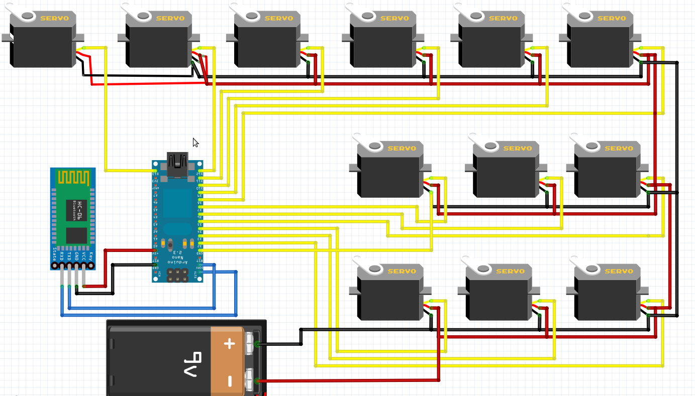
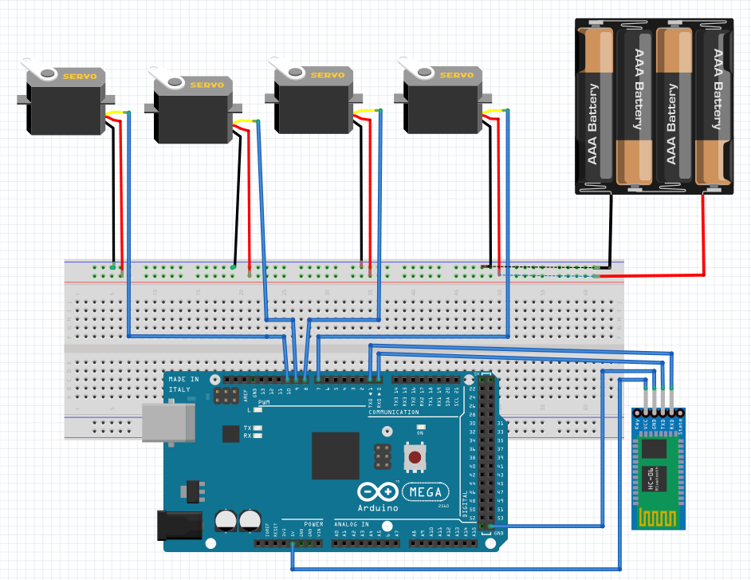
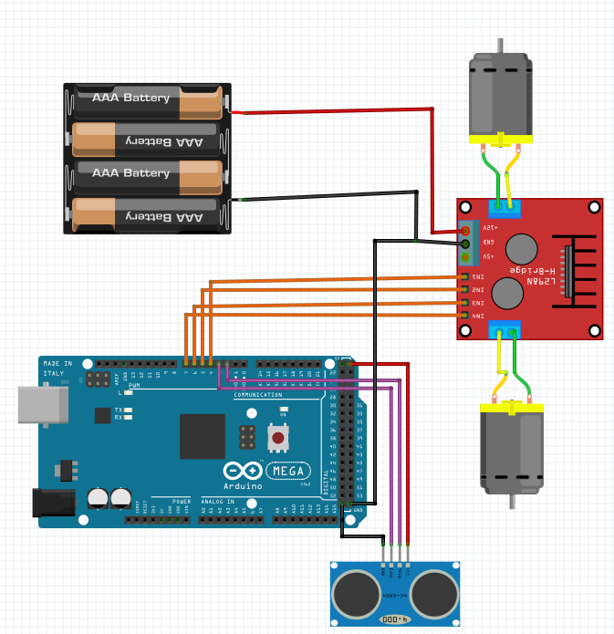
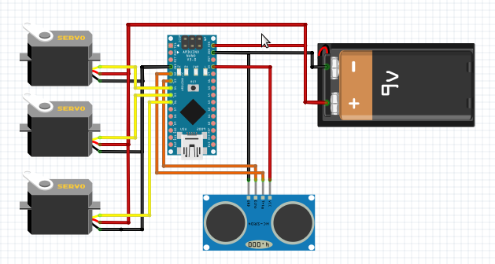
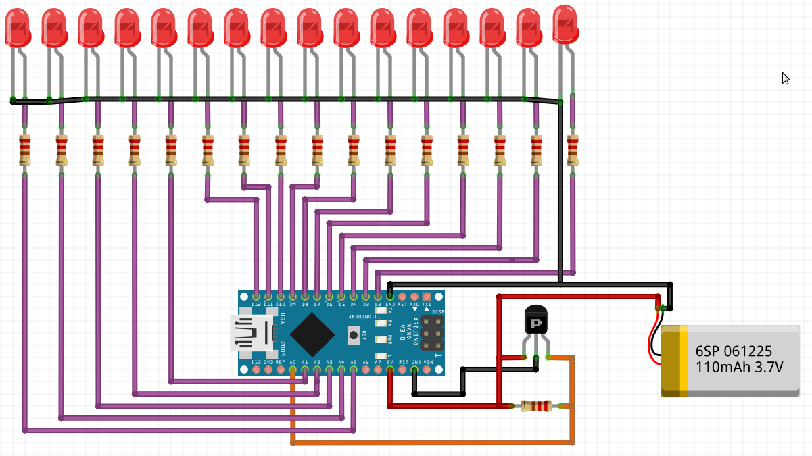

# PROYECTOS CON ARDUINO
Los siguientes proyectos estan Basados en codigo de Arduino.

## Araña Robot

Se pueden observar algunos principios básicos de movimiento en extremidades, debido que para que este prototipo tenga un movimiento más optimo, tinen que poder realizar movimientos no forzados para los diferentes servomotores.

#### Lista de Materiales

|  Electrónica | Cantidad |  Mecánica  | Cantidad |
| :------------ | --------: | :---------  | --------: |
| Servo Motor  |    12    |Piezas en Acrilico| x |
| Arduino nano |     1    |Tornillo Stovebolt 3/16 x 1 | 6 |
| HC-06 |    1    | Tornillo autorroscante 3/32 X ¼  | 16  |
| Jumpers |     x    |  | |
| Placa para Nano |    1    |  |  | 
| Porta pilas 9v |     1  |     |   |
| Pila 9v |     1    |  |   |

#### Piezas para impresion 3D

Se imprime 1 vez cada uno:

-[Cuerpo Inferior](ArañaRobot/Piezas/files/body_d.stl).
-[Cuerpo Superior](ArañaRobot/Piezas/files/body_u.stl).

Se imprime 2 veces cada uno:

-[Tibia Izquierda](ArañaRobot/Piezas/files/tibia_l_fixed.stl).
-[Tibia DErecha](ArañaRobot/Piezas/files/tibia_r_fixed.stl).
-[Servo Base Izquierda](ArañaRobot/Piezas/files/coxa_l_fixed.stl).
-[Servo Base Derecha](ArañaRobot/Piezas/files/coxa_r_fixed.stl).

Se imprime 4 veces cada uno:

-[Femur](ArañaRobot/Piezas/files/femur_1_fixed.stl).
-[soporte Servo de patas](ArañaRobot/Piezas/files/s_hold.stl).

#### Esquematico

  

## Brazo Robot

El diseño del código esta planteado para un tipo de brazo robot, el cual esta anexado en su carpeta por si desean hacer la impresion en 3D.
Tomar en cuenta que dos de los 4 servomotores se encuentran a una misma altura.

#### Lista de Materiales

|  Electrónica | Cantidad |  Mecánica  | Cantidad |
| :------------ | --------: | :---------  | --------: |
| Servo Motor  |    12    |Piezas en Acrilico| x |
| Arduino nano |     1    |Tornillo Stovebolt ⅛ x ¾ | 8 |
| HC-06 |    1    | Tuerca hexagonal ⅛  | 8  |
| Jumpers |     x    |  Tornillo 3/16 x ¾| 1 |
| Protoboard |    1   | Tuerca Stovebolt 3/16| 8   |
| Porta pilas 9v |     1  |Tornillo Stovebolt 3/16 x 1/2| 7|
| Pila 9v |     1    |  |   |

#### Piezas para impresion 3D

Se imprime 1 vez cada uno:

-[Soporte dos servos](BrazoRobot/Piezas/EBA_01.00.001.STL).
-[Accionamiento servo derecho](BrazoRobot/Piezas/EBA_01.00.002_vertical_drive_arm.STL).
-[Accionamiento brazo delantero](BrazoRobot/Piezas/EBA_01.00.004_forward_drive_arm.STL).
-[Brazo horizontal](BrazoRobot/Piezas/EBA_01.00.005_horizontal_arm.STL).
-[Enlace triangular](BrazoRobot/Piezas/EBA_01.00.006_triangular_link.STL).
-[Base](BrazoRobot/Piezas/EBA_01.00.010_basement.STL).
-[Tapa de la base](BrazoRobot/Piezas/EBA_01.00.011_round_plate.STL).
-[Soporte de garra](BrazoRobot/Piezas/EBA_01.00.012_R01_claw_support.STL).
-[Garra derecha](BrazoRobot/Piezas/EBA_01.00.013_R01_right_finger.STL).
-[Garra izquierda](BrazoRobot/Piezas/EBA_01.00.014_R01_left_finger.STL).
-[Engranaje de servo garra](BrazoRobot/Piezas/EBA_01.00.015_drive_gear.STL).
-[Engranaje garra derecha](BrazoRobot/Piezas/EBA_01.00.016_R01_driven_gear.STL).

Se imprime 2 veces cada uno:

-[Enlace](BrazoRobot/Piezas/EBA_01.00.003_link.STL).
-[Placa servo](BrazoRobot/Piezas/EBA_01.00.009_servo_plate.STL).

#### Esquematico

  

## Carrito evita choques

#### Lista de Materiales

|  Electrónica | Cantidad |  Mecánica  | Cantidad |
| :------------ | --------: | :---------  | --------: |
| Motor DC  |    2    | Ruedas | 2 |
| Arduino Mega |     1    | Base de acrilico| 2 |
| Jumpers |    x    | Rueda loca| 2 |
| HC-SR04 |    1    |  Caja de pila 9v   |  1  |
| L298 |     1  |  | |
| Pila 9v |     1    |  |  |

#### Esquematico

  

## Lagarto Robot

#### Lista de Materiales

|  Electrónica | Cantidad |  Mecánica  | Cantidad |
| :------------ | --------: | :---------  | --------: |
| Servo Motor  |    3    |Piezas en Acrilico| x |
| Arduino nano |     1    | |  |
| Jumpers |    x    | | |
| shield Nano |    1    |  |  | 
| Porta pilas 9v |     1  |     |   |
| Pila 9v |     1    |  |   |

#### Piezas para impresion 3D

Se imprime 1 vez cada uno:
-[Base Cola](LagartoRobot/Piezas/base_cola.stl).
-[Cabeza](LagartoRobot/Piezas/ccabeza_lagarto.stl).
-[Cola](LagartoRobot/Piezas/cola.stl).
-[Cuerpo](LagartoRobot/Piezas/cuerpo_lagarto.stl).
-[Nariz](LagartoRobot/Piezas/nariz.stl).
-[Sensor](LagartoRobot/Piezas/sensor_lagarto.stl).
-[Soporte de Cola](LagartoRobot/Piezas/soporte_cola_v2.stl).

Se imprime 2 veces:

-[Base Pata](LagartoRobot/Piezas_de_Lagarto/base_pata.stl).
-[Union pata-cola](LagartoRobot/Piezas/union_pata_cola.stl).

Se imprime 4 veces:

-[Pata](LagartoRobot/Piezas/pata_v7.stl).

#### Esquematico

  

## Propeller Clock

#### Lista de Materiales

|  Electrónica | Cantidad |  Mecánica  | Cantidad |
| :------------ | --------: | :---------  | --------: |
| Motor DC  |    1    | Baquelita de cobre | 1 |
| LED verde |     5    | |  |
| LED rojo |    11   | |  |
| LED azul |    1    |    |  |
| Espadines Hembra |   2  |  | |
| Sensor Hall |     1    |  |  |
| Espadines Macho |     5    |  |  |
| Bateria 3.7V 240mA |     1    |  |  |

#### Esquematico

  

## Wall_E

#### Lista de Materiales

|  Electrónica | Cantidad |  Mecánica  | Cantidad |
| :------------ | --------: | :---------  | --------: |
| Motor DC  |    2    |  Caja de pila 9v | 1|
| Arduino Mega |     1    | |  |
| Jumpers |    x    | |  |
| HC-SR04 |    1    |   |    |
| L298 |     1  |  | |
| Pila 9v |     1    |  |  |

#### Esquematico

  

<!-- # Proyectosgit -Arduino -->
